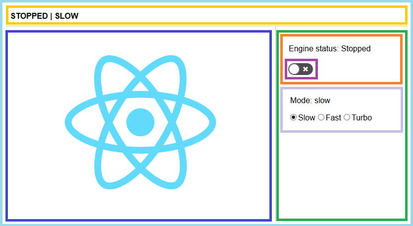

## Why create-react-app?
- React, JSX, ES6 and Flow syntax support (Babel, Webpack, Flow).
- Language extras beyond ES6 and polyfills (dynamic import, promise, object-assign, ...).
- Dev server with lint support (webpack-dev-server, ESLint).
- Import CSS and image files from JavaScript (Webpack, css-loader, style-loader).
- Autoprefixed CSS (PostCSS, Autoprefixer).
- Script to bunde JS, CSS and images for production (Webpack, html-webpack-plugin).
- Test suite ready to use (Jest).
- many more ...

## Script commands
`yarn start`: Runs the app in development mode.

- Page reloads after edit.
- Build errors and lint warnings appear in console.

`yarn test`: Runs the test watcher in interactive mode.

- Tests re-run after edit.

`yarn build`: Builds the app for production in build folder.
	
- Bundles React in production mode and optimizes build (minified, hashes are created).

`yarn eject`: Copies conf. files and transitive dependencies into your project and gives you full control.

Use `yarn add <package name>` to add a new package.

## Tools

**IDE: VS Code**

- IntelliSense (React/JSX), Babel support, ...
- Extensions (e.g. ESLint, Jest).

**React Developer Tools (Chrome/FF)**

- Inspect props/state of components.
- Highlight component updates.

## How to create a new app
**(Node.js >= 6 is required)**

- Installation
	
		npm install -g create-react-app
		create-react-app demo
		cd demo
		yarn start

- Open [http://localhost:3000/](http://localhost:3000/)
- Run `npm install -g eslint` if you want lint support.

## Thinking in React

1. Break the UI into a component hierarchy.
2. Build a static version in React.
3. Identify the minimal (but complete) representation of UI state.
4. Identify where your state should live.
5. Add inverse data flow.

## Demo: Component hierarchy

 
